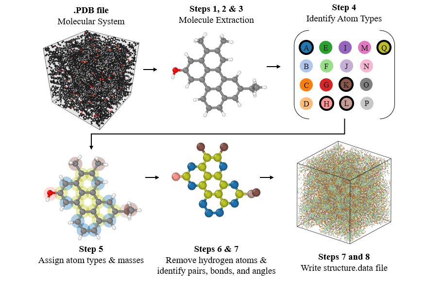
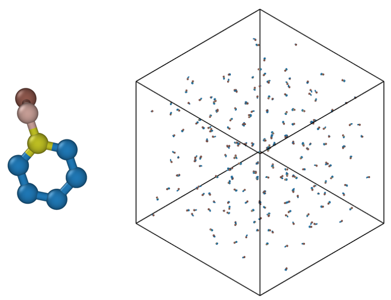
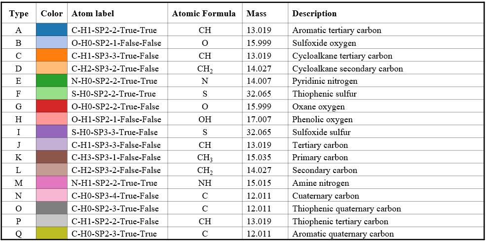

# AA2UA (All-Atom to United Atom)

AA2UA is an open-source software package designed to convert
all-atom [Protein Data Bank (PDB)](https://en.wikipedia.org/wiki/Protein_Data_Bank_(file_format)) molecular models into
their Coarse-Grained (CG) United Atom (UA) counterparts presented in the
journal article entitled [Introducing a force-matched united atom force field to explore larger spatiotemporal domains
in molecular dynamics simulations of bitumen](https://doi.org/10.1016/j.matdes.2024.112831)

Using [Python 3.12](https://docs.python.org/3/whatsnew/3.12.html) and [Rdkit](https://www.rdkit.org/), the software
automatically reads .PDB files containing all-atom information of a molecular
system, extracts each molecule, determines higher order bonding information, assigns force field atom types and
masses, and generates a [LAMMPS structure file](https://docs.lammps.org/2001/data_format.html) with all the topologies
and force field definitions required
to run a LAMMPS simulations using the developed UA force field. AA2UA ensures a seamless conversion process,
making it easier for researchers to explore material properties without the extensive manual effort typically required
for such conversions.


## Quick start

Upon successfully installing [Numpy](https://numpy.org/),
[Numba](https://numba.pydata.org/) and [Rdkit](https://www.rdkit.org/), you are ready to run
AA2UA. Follow the steps below to get started:

1. **Run the Command**: Execute the following command in your terminal
   or command prompt:
   ``` bash
   python aa2ua.py
   ```

   By default, there are five .pdb files included in the `input/`
   directory: `ethylbenzene.pdb`, `phenol.pdb`, `pyrrole.pdb`, `thiophene.pdb`, and
   `mixture.pdb`. These files correspond to all-atom mixtures of different organic molecules of various complexities.
   Upon
   executing `python aa2ua.py`, all five files will be converted into their UA counterparts.

2. **Locating & Visualizing the Output**:
   The results are exported into the `/outputs` directory, with each structure.data file named after its corresponding
   input file. The resulting files can be easily visualized using [OVITO](https://www.ovito.org/). The ethylbenzene
   model,
   in its UA form, should look like this:
   

3. **Loading into LAMMPS**:
   Use the LAMMPS' [read_data](https://docs.lammps.org/read_data.html) command in an input script to import the
   structure.data file generated by AA2UA.

## What kind of atomistic systems can be converted?

This can be answered by analysing the type of systems compatible with the UA-CG force field developed by our team. As of
now, only amorphous hydrocarbon systems are compatible, especially those whose composition is based on molecules used in
the oil, gas, and asphalt industries. To get an idea of the variety of molecules that can be converted, refer to Table 2
in https://doi.org/10.1016/j.matdes.2024.112831.

## Architecture

A comprehensive flow diagram depicting the function calls during the program’s execution can be seen in the figure
below.
A description of all the functions, including their inputs and outputs ("docstring" style) follows the figure.


### `__main__`

**Description**: Main execution flow of the script.

---

### `initialize_log_file()`

**Description**: Initializes the log file.

**Parameters**:

- `filename` (str): Name of the log file (default: 'calls_log.txt').

**Returns**: `None`

---

### `log_message_to_file(message: str, printmsg: bool = False)`

**Description**: Logs a custom message to 'calls_log.txt'.

**Parameters**:

- `message` (str): The text message to log.
- `printmsg` (bool): Whether to also print the message to the command line (default: False).

**Returns**: `None`

---

### `read_pdb_file(filename: str) -> list`

**Description**: Reads the contents of a PDB file and returns it as a list of lines.

**Parameters**:

- `filename` (str): The path to the PDB file.

**Returns**: `list`: A list containing the lines of the file.

---

### `extract_pdb_box_dimensions(pdb_header: str) -> dict`

**Description**: Extracts box dimensions from PDB header.

**Parameters**:

- `pdb_header` (str): PDB header containing box dimensions.

**Returns**: `dict`: Dictionary containing box dimensions.

---

### `extract_molecules(pdb_lines: list) -> list`

**Description**: Extracts and groups molecules from a list of PDB file lines into separate blocks.

**Parameters**:

- `pdb_lines` (list): The lines of a PDB file.

**Returns**: `list`: A list of molecule blocks, each represented as a list of lines.

---

### `generate_lammps_data(molecule_blocks: list, output_file: str, box_dimensions: dict) -> None`

**Description**: Generates a LAMMPS data file from molecule blocks.

**Parameters**:

- `molecule_blocks` (list): A list of lists, where each inner list represents a molecule block in PDB format.
- `output_file` (str): The name of the output file to write the LAMMPS data.
- `box_dimensions` (dict): The dimensions of the simulation box.

**Returns**: `None`

---

### `rdDetermineBonds.DetermineBondOrders(mol)`

**Description**: Determines bond orders for the molecule.

**Parameters**:

- `mol`: RDKit molecule object.

**Returns**: `None`

---

### `Chem.RemoveAllHs(mol)`

**Description**: Removes hydrogen atoms from the molecule.

**Parameters**:

- `mol`: RDKit molecule object.

**Returns**: `rdkit.mol`: RDKit molecule object with hydrogens removed.

---

### `generate_atom_info_list(mol) -> tuple`

**Description**: Generates a list of atom labels and their indices for a molecule.

**Parameters**:

- `mol`: RDKit molecule object.

**Returns**: `tuple`: A tuple containing a list of atom index and label pairs, and the list of atoms.

The format for these labels is:

`$atom_type-H$n_hydrogens-$hybridization-$degree-$is_in_ring-$is_aromatic`

where:

- **atom_type**: The chemical symbol of the atom.
- **n_hydrogens**: The number of hydrogen atoms bonded to the atom.
- **hybridization**: The hybridization state of the atom.
- **degree**: The number of directly bonded neighbors.
- **is_in_ring**: A boolean indicating if the atom is part of a ring.
- **is_aromatic**: A boolean indicating if the atom is in an aromatic ring.

---

### `get_atom_types(atom_info_list: list, used_atom_types: set) -> tuple`

**Description**: Maps atom labels to force field types and updates the set of used atom types.

**Parameters**:

- `atom_info_list` (list): A list of tuples where each tuple contains an atom index and its corresponding label.
- `used_atom_types` (set): A set of previously used atom types.

**Returns**: `tuple`: A tuple containing a dictionary mapping atom indices to their force field types, and the updated
set of used atom types. A `ValueError` is raised if any of the atoms in the molecule cannot be assigned with a force
field type.

A detailed description of all the 17 bead types in the UA the force field, identified from A through Q, can be found in
the figure below.


---

### `process_bonds(bonds: list, atom_types: dict, bond_type_to_int: dict, bond_type_index: int) -> tuple`

**Description**: Identifies and processes bond types, mapping them to unique integers.

**Parameters**:

- `bonds` (list): A list of bonds in the molecule.
- `atom_types` (dict): A dictionary mapping atom indices to their force field types.
- `bond_type_to_int` (dict): A dictionary mapping bond type keys to integers.
- `bond_type_index` (int): The current index to be assigned to a new bond type.

**Returns**: `tuple`: A tuple containing a list of bond types with their atom indices, an updated bond type to integer
mapping, and the next bond type index.

---

### `process_angles(bonds: list, atom_types: dict, angle_type_to_int: dict, angle_type_index: int) -> tuple`

**Description**: Identifies and processes angle types, mapping them to unique integers.

**Parameters**:

- `bonds` (list): A list of bonds in the molecule.
- `atom_types` (dict): A dictionary mapping atom indices to their force field types.
- `angle_type_to_int` (dict): A dictionary mapping angle type keys to integers.
- `angle_type_index` (int): The current index to be assigned to a new angle type.

**Returns**: `tuple`: A tuple containing a list of angle types with their atom indices, an updated angle type to integer
mapping, and the next angle type index.

---

### `get_particle_positions(mol, atoms) -> dict`

**Description**: Retrieves the 3D positions of non-hydrogen atoms in a molecule.

**Parameters**:

- `mol`: RDKit molecule object.
- `atoms` (list): A list of atoms in the molecule.

**Returns**: `dict`: A dictionary mapping atom indices to their 3D positions.

---

### `convert_atom_types_to_int(used_atom_types: set) -> dict`

**Description**: Converts atom types into unique integers.

**Parameters**:

- `used_atom_types` (set): A set of atom types.

**Returns**: `dict`: A dictionary mapping each atom type to a unique integer.

---

### `write_lammps_file_header(file, total_atoms: int, total_bonds: int, total_angles: int, used_atom_types: set, bond_type_to_int: dict, angle_type_to_int: dict, box_dimensions: dict) -> None`

**Description**: Writes the header information to a LAMMPS data file.

**Parameters**:

- `file`: The file object to write the header information to.
- `total_atoms` (int): The total number of atoms.
- `total_bonds` (int): The total number of bonds.
- `total_angles` (int): The total number of angles.
- `used_atom_types` (set): A set of used atom types.
- `bond_type_to_int` (dict): A dictionary mapping bond type keys to integers.
- `angle_type_to_int` (dict): A dictionary mapping angle type keys to integers.
- `box_dimensions` (dict): A dictionary containing the dimensions of the simulation box.

**Returns**: `None`

---

### `write_lammps_file_masses(file, atom_type_to_int: dict) -> None`

**Description**: Writes mass information for each atom type to a LAMMPS data file.

**Parameters**:

- `file`: The file object to write the mass information to.
- `atom_type_to_int` (dict): A dictionary mapping atom types to unique integers.

**Returns**: `None`

---

### `write_lammps_file_atoms(file, molecule_data: list, atom_type_to_int: dict) -> None`

**Description**: Writes atom data to a LAMMPS data file.

**Parameters**:

- `file`: The file object to write the atom information to.
- `molecule_data` (list): A list of dictionaries containing molecule information.
- `atom_type_to_int` (dict): A dictionary mapping atom types to unique integers.

**Returns**: `None`

---

### `write_lammps_file_bonds(file, molecule_data: list) -> None`

**Description**: Writes bond data to a LAMMPS data file.

**Parameters**:

- `file`: The file object to write the bond information to.
- `molecule_data` (list): A list of dictionaries containing molecule information.

**Returns**: `None`

---

### `write_lammps_file_angles(file, molecule_data: list) -> None`

**Description**: Writes angle data to a LAMMPS data file.

**Parameters**:

- `file`: The file object to write the angle information to.
- `molecule_data` (list): A list of dictionaries containing molecule information.

**Returns**: `None`

---

## License

AA2UA is licensed under the GNU General Public License (GPL), which is
a widely used free software license that guarantees end users the
freedom to run, study, share, and modify the software.
The GPL license aims to ensure that the software remains free and
open-source for all its users. For detailed terms and conditions, please
refer to the full license text.
The full text of the GPL license can be found at the official GNU
website or included directly within this documentation.

For the full GPL license text, you may visit the [GNU General Public
License v3.0](https://www.gnu.org/licenses/gpl-3.0.html) website.

If you are using this script for your research, please cite **Introducing a force-matched united atom force field to
explore larger spatiotemporal domains
in molecular dynamics simulations of bitumen** (DOI: https://doi.org/10.1016/j.matdes.2024.112831).

## Credits

The script was created by Eli I. Assaf (e.i.assaf@tudelft.nl), Xueyan Liu, and Sandra Erkens, all affiliated
at [TU Delft](https://www.tudelft.nl/).
The incentive of producing such script was to normalize the use of Python-based tools to perform MD simulations with
relative ease.

This script is created under the research program Knowledge-based
Pavement Engineering (KPE). KPE is a cooperation between
[Rijkswaterstaat](https://www.rijkswaterstaat.nl/),
[TNO](https://www.tno.nl/nl/), and [TU Delft](https://www.tudelft.nl/)
in which scientific and applied knowledge is gained about asphalt
pavements and which contributes to the aim of Rijkswaterstaat to be
completely climate neutral and to work according to the circular
principle by 2030. The opinions expressed in these papers are solely
from the authors.
